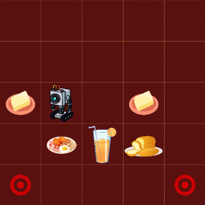

<div id="top"></div>

<!-- PROJECT LOGO -->
<br />
<div align="center">
  <a href="https://github.com/aminhbl/pathfinding-algorithms">
    
  </a>

<h3 align="center">Pathfinding Algorithms</h3>

  <p align="center">
    Best path to pass the butter!
    <br />
    <a href="https://aminhbl.github.io/pathfinding-algorithms/">GitHub Page</a>
    <br/>
  </p>
</div>


<!-- TABLE OF CONTENTS -->
<details>
  <summary>Table of Contents</summary>
  <ol>
    <li>
      <a href="#about-the-project">About The Project</a>
      <ul>
        <li><a href="#built-with">Built With</a></li>
      </ul>
    </li>
    <li>
      <a href="#getting-started">Getting Started</a>
      <ul>
        <li><a href="#installation">Installation</a></li>
      </ul>
    </li>
    <li><a href="#usage">Usage</a>
        <ul>
            <li><a href="#example-run">Example Run</a></li>
            <li><a href="#preview">Preview</a></li>
        </ul>
    </li>
    <li><a href="#contributing">Contributing</a></li>
    <li><a href="#license">License</a></li>
    <li><a href="#contact">Contact</a></li>
  </ol>
</details>


<!-- ABOUT THE PROJECT -->
## About The Project
There are many algorithms for finding the optimal path between two points, here we practice `IDS`,  `Bidirectional-BFS`,
and `A*` for a robot that its job is to pass the butter on a breakfast table with other objects as obstacles. The map of the table is given as input in form of a matrix with the following descriptions:
* The price for the robot to go from a cell to another is given in each matrix cell
* Robot's initial place is represented with the letter 'r'
* Butters, Obstacles, and targets are represented with 'b', 'x', and 'p' respectively
<br/>
<p>Robot itself has the following restrictions:</p>

* Robot can only push the butter, and it cannot be dragged.
* There can be many butters on the table though robot can only push one butter at the time.
* Robot can only move in four cardinal directions.
* Entirety of table is visible to robot.
* Robot shall not drop itself, or a butter off the table.

<p>As mentioned the goal is for the robot to pass the butters to as many target points as we have. </p>
<p>This project is inspired by the <a href="https://www.imdb.com/title/tt2861424/"> Rick and Morty </a> robot, that in one episode is designed by Rick 
for the sheer purpose of passing the butter on the breakfast table!</p>


### Built With

* [Python3](https://www.python.org/)
* [NumPy](https://numpy.org/)
* [PyGame](https://www.pygame.org/)

<p align="right">(<a href="#top">back to top</a>)</p>


<!-- GETTING STARTED -->
## Getting Started
First off make sure that you have `pip` installed on your system and then you need to have the following installations to run the program.
### Installation

1. Install NumPy
   ```sh
   pip install numpy
   ```
2. Install PyGame
   ```sh
   pip install pygame
   ```

<p align="right">(<a href="#top">back to top</a>)</p>


<!-- USAGE EXAMPLES -->
## Usage
### Example Run
You can run each algorithm separately, just choose your algorithm and run it like this:
```bash
    $ python3 ids.py
   ```
After running the program you need to provide a matrix and its width and length to map the table. An example of this matrix is shown below:
```
    5   5
    1   1   1   1   1
    1   1   1   1   1
    1   1b  1r  1b  1
    1   x   x   x   1
    1p  1   1   1   1p
```
### Preview
After providing the table as input you should see something like this:
 


<p align="right">(<a href="#top">back to top</a>)</p>


<!-- CONTRIBUTING -->
## Contributing
If you have a suggestion that would make this project better, please fork the repo and create a pull request. You can also simply open an issue with the tag "enhancement".
Don't forget to give the project a star! Thanks again!

1. Fork the Project
2. Create your Feature Branch (`git checkout -b feature/AmazingFeature`)
3. Commit your Changes (`git commit -m 'Add some AmazingFeature'`)
4. Push to the Branch (`git push origin feature/AmazingFeature`)
5. Open a Pull Request

<p align="right">(<a href="#top">back to top</a>)</p>


<!-- LICENSE -->
## License

Distributed under the MIT License. See `LICENSE` for more information.

<p align="right">(<a href="#top">back to top</a>)</p>


<!-- CONTACT -->
## Contact

[M. Amin Habibollah](https://github.com/aminhbl)
<br/>
Email: amin.habibllh@gmail.com
<br/>
Project Link: [https://github.com/aminhbl/pathfinding-algorithms](https://github.com/aminhbl/pathfinding-algorithms)
<br/>
<br/>
[![LinkedIn][linkedin-shield]][linkedin-url]
<p align="right">(<a href="#top">back to top</a>)</p>


[linkedin-shield]: https://img.shields.io/badge/-LinkedIn-black.svg?style=for-the-badge&logo=linkedin&colorB=555
[linkedin-url]: https://www.linkedin.com/in/amin-habibllh/